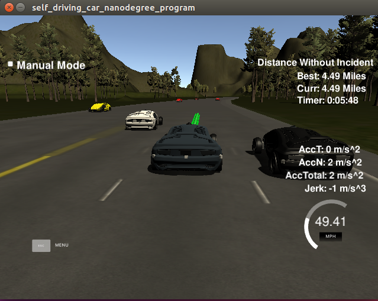
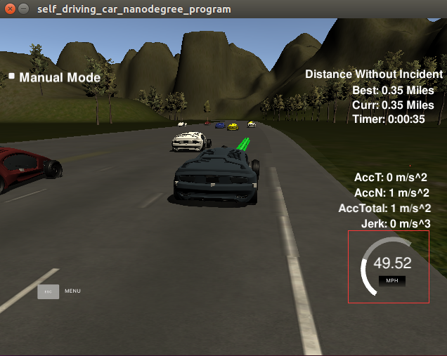
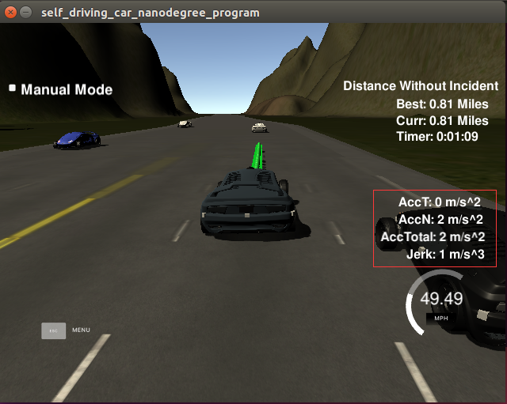
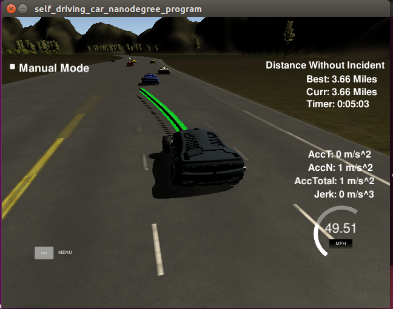

# Path Planning Project Starter Code
Self-Driving Car Engineer Nanodegree Program

In this project I will utilize a Path Planning in the simulator. 

The goals / steps of this project are the following:

* 1.The code compiles correctly.
* 2.The car is able to drive at least 4.32 miles without incident.
* 3.The car drives according to the speed limit.
* 4.Max Acceleration and Jerk are not Exceeded.
* 5.Car does not have collisions.
* 6.The car stays in its lane, except for the time between changing lanes.
* 7.The car is able to change lanes
* 8.There is a reflection on how to generate paths.

  
### [Rubric](https://review.udacity.com/#!/rubrics/1020/view) Points
### Here I will consider the rubric points individually and describe how I addressed each point in my implementation.  
  
#### 1.The code compiles correctly.
I compile project by following instructions:

1. mkdir build
2. cd build
3. cmake ..
4. make
5. ./path_planning
  
  
#### 2.The car is able to drive at least 4.32 miles without incident.
My car can drive 4.32 miles, here is a screenshot:
<div class="test">

</div>

  
  
#### 3.The car drives according to the speed limit.
My car follows a speed limit of 50 MPH, here is a screenshot£º
<div class="test">

</div>

  
  
#### 4.Max Acceleration and Jerk are not Exceeded.
My car drive below a total acceleration of 10 m/s^2 and a jerk of 10 m/s^3, here is a screenshot: 
<div class="test">

</div>

 
  
  

#### 5.Car does not have collisions.
My car does not actively collide with other vehicles,   
but other vehicles occasionally suddenly change lanes and collide.
  
  
#### 6.The car stays in its lane, except for the time between changing lanes.
My car can change lanes quickly.

 
  
#### 7.The car is able to change lanes.
My car can change lanes, here is a screenshot:
<div class="test">

</div>

  
#### 8.There is a reflection on how to generate paths.
I copy the codes from [lesson](https://classroom.udacity.com/nanodegrees/nd013/parts/6047fe34-d93c-4f50-8336-b70ef10cb4b2/modules/27800789-bc8e-4adc-afe0-ec781e82ceae/lessons/23add5c6-7004-47ad-b169-49a5d7b1c1cb/concepts/3bdfeb8c-8dd6-49a7-9d08-beff6703792d)  
1.Get current and previous position of the car in map coordiate.
```


               if(prev_size < 2){
                    double prev_car_x = car_x - cos(car_yaw);
                    double prev_car_y = car_y - sin(car_yaw);

                    ptsx.push_back(prev_car_x);
                    ptsx.push_back(car_x);
 
                    ptsy.push_back(prev_car_y);
                    ptsy.push_back(car_y);
					
                }
                else{
                    ref_x = previous_path_x[prev_size - 1];
                    ref_y = previous_path_y[prev_size - 1];

                    double ref_x_prev = previous_path_x[prev_size - 2];
                    double ref_y_prev = previous_path_y[prev_size - 2];

                    ref_yaw = atan2(ref_y - ref_y_prev, ref_x - ref_x_prev);

                    ptsx.push_back(ref_x_prev);
                    ptsx.push_back(ref_x);

                    ptsy.push_back(ref_y_prev);
                    ptsy.push_back(ref_y);
                }
                
```
  
2.Get the 3 coordinates in front of the car, (car_s + 30, d_next_land)£¬(car_s + 60, d_next_land)£¬(car_s + 90, d_next_land).
```

                vector<double> next_wp0 = getXY(car_s + 30, (2+4*lane), map_waypoints_s, map_waypoints_x, map_waypoints_y);
                vector<double> next_wp1 = getXY(car_s + 60, (2+4*lane), map_waypoints_s, map_waypoints_x, map_waypoints_y);
                vector<double> next_wp2 = getXY(car_s + 90, (2+4*lane), map_waypoints_s, map_waypoints_x, map_waypoints_y);

                ptsx.push_back(next_wp0[0]);
                ptsx.push_back(next_wp1[0]);
                ptsx.push_back(next_wp2[0]);

                ptsy.push_back(next_wp0[1]);
                ptsy.push_back(next_wp1[1]);
                ptsy.push_back(next_wp2[1]);
                
```
  
3.Convert the map coordinates of the first two steps to the car coordinates.
```
                    ptsx[i] = (shift_x * cos(0 - ref_yaw) - shift_y * sin(0 - ref_yaw));
                    ptsy[i] = (shift_x * sin(0 - ref_yaw) + shift_y * cos(0 - ref_yaw));
```
  
4.Fitting a spline from the points obtained in the first two steps.
```
                tk::spline s;
                s.set_points(ptsx, ptsy);
```
   
5.Get previous_path_x and previous_path_y from sensor and if the size of previous_path_x less than 50 ,use spline polynomial function to add points to 50.
```
                for(int i = 1; i<= 50 - previous_path_x.size(); i++){

                    double N = (target_dist/(0.02 * ref_vel/2.24));
                    double x_point = x_add_on + (target_x) / N;
                    double y_point = s(x_point);

                    x_add_on = x_point;

                    double x_ref = x_point;
                    double y_ref = y_point;

                    x_point = (x_ref * cos(ref_yaw) - y_ref * sin(ref_yaw));
                    y_point = (x_ref * sin(ref_yaw) + y_ref * cos(ref_yaw));

                    x_point += ref_x;
                    y_point += ref_y;

                    next_x_vals.push_back(x_point);
                    next_y_vals.push_back(y_point);
   
                }
                
```
